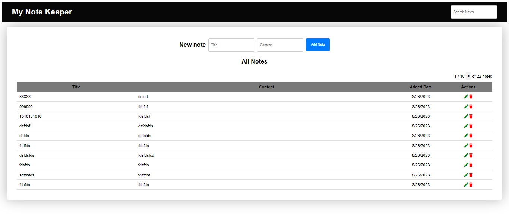

<h1>My Note Keeper App</h1>



<h2>## Overview</h2>

<p>Welcome to <strong>**My Note Keeper**</strong>, a simple web application that allows you to create and manage your notes seamlessly. This project showcases a full-stack application with HTML, CSS, and JavaScript for the front end, Node.js with Express for the back end, and MongoDB for the database.</p>


<h2>Running the app:</h2>

<h3>Client Side</h3>

<p>To access the client side of the app, follow these steps:</p>

<ol>
    <li>Open <code>index.html</code> in your preferred web browser.</li>
    <li>This will load the front end interface, where you can interact with your notes.</li>
</ol>


<h3>Server Side</h3>

<p>Follow these instructions to set up and run the server side of the app:</p>
<ol>
    <li>Navigate to the server directory using your terminal.</li>
    <li>Install the required Node.js packages by running the command:</li>
</ol>

```bash
npm install
```


<p>Create a new <code>.env</code> file in the server directory and configure it with the following environment variables:</p>

```JavaScript
PORT=your_desired_port
DB_HOST=your_mongodb_connection_string
```
<p>Make sure to install the nodemon package globally. If you haven't already, you can install it using the command:</p>

```bash
npm install -g nodemon
```
<p>Start the server by running the following command in the terminal:</p>

```bash
nodemon server.js
```

<h2>Technologies Used</h2>

<ol>
    <li>Front End: HTML, CSS, JavaScript</li>
    <li>Back End: Node.js, Express</li>
    <li>Database: MongoDB</li>
</ol>

<p>Feel free to explore, modify, and enhance this project as you see fit. Happy note-keeping! 📝</p>


